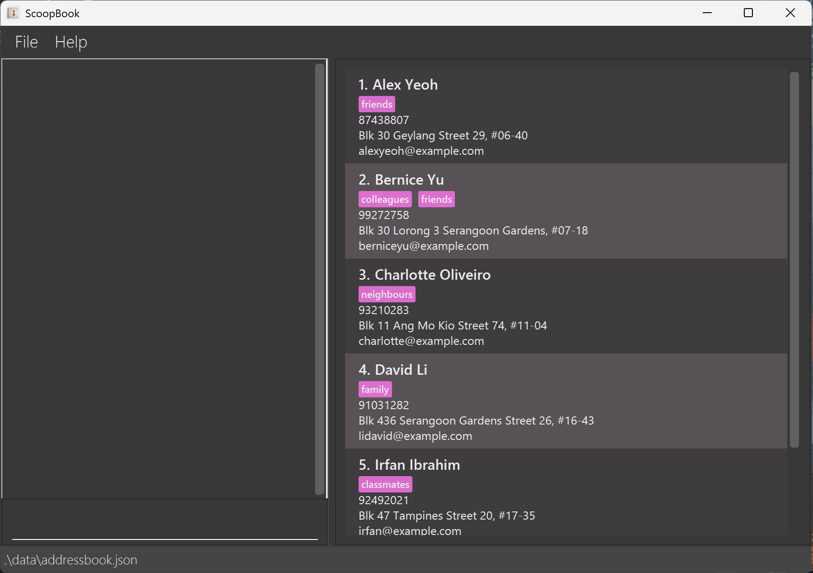

# ScoopBook
Scoopbook is a lightweight **desktop application** to manage your contacts. Specialised and catered to journalists seeking a faster and offline solution to efficiently manage their contacts.

## UI Mockup

## Features
### Adding contacts: `add`
- **Purpose**: Adds a new contact to the contact book

- **Command format**: `add n/NAME [p/PHONENUMBER] [e/EMAILADDRESS] [a/ADDRESS] [t/TAG]` — the fields wrapped in square brackets are optional

- **Example commands**: 
  - `add n/John Doe`
  - `add n/John Doe p/98765432`
  - `add n/John Doe e/secretsource@gmail.com t/keep him a secret t/anothertag`
 

### List all contacts: `list`
- **Purpose**: Shows a list of all sources/persons in the contact book

- **Command format**: `list`

- **Example commands**: `list`
  - Note: This functionality takes in no extraneous parameters.
 

### Deleting contacts: `delete`
- **Purpose**: Deletes a contact in the contact book

- **Command format**: `delete INDEX`

- **Example commands**: 
  - Basic deletion: `list` followed by `delete 2` deletes the 2nd person in the contact book.
 

### Saving data
- **Purpose**: To save relevant data after any data has been modified

- **Command format**: Nil

- **Example commands**: Nil
  - **Note**: Scoopbook data are saved in the hard disk automatically after any command that changes the data. There is no need to save manually.
 

## Authors
Find out more about us on our [About Us](https://ay2425s2-cs2103t-w13-1.github.io/tp/AboutUs.html) page!

## Acknowledgements
This project is based on the AddressBook-Level3 project created by the [SE-EDU initiative](https://se-education.org).  
We would also like to thank all professors, TAs, coursemates and friends who have helped and supported us throughout the project.

