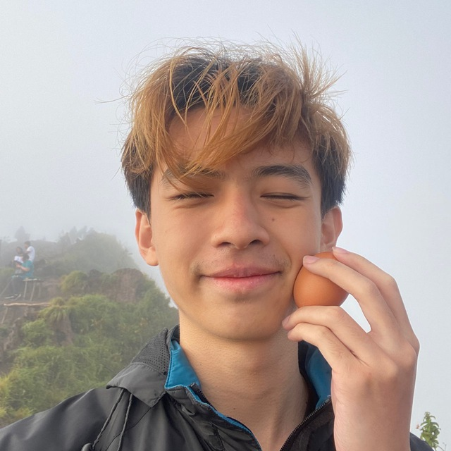
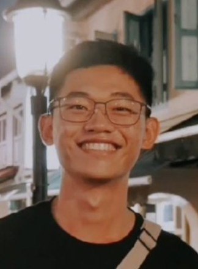
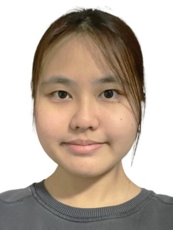
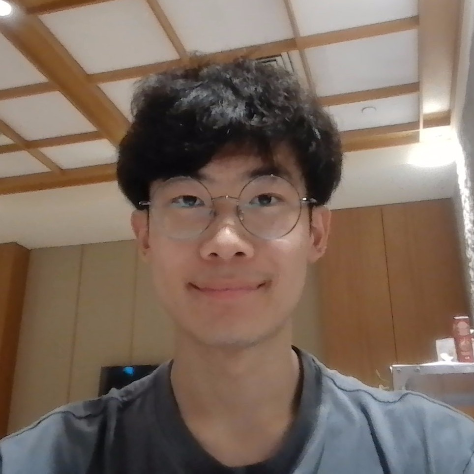

We are a team based in the [School of Computing, National University of Singapore](https://www.comp.nus.edu.sg).

You can reach us at the email `seer[at]comp.nus.edu.sg`

## Project team

### Shawn Goh

[[homepage](https://shawnnygoh.github.io/)]
[[github](https://github.com/shawnnygoh)]
[[portfolio](team/shawn.md)]

* Role: Deliverables and Deadlines

### Freddie Ong

[[github](http://github.com/souledfigurine)]

* Role: Testing
* Responsibilities: unconfirmed

### Chua Wen Ting

[[github](http://github.com/wentingchua)]

* Role: Developer
* Responsibilities: Scheduling and tracking: In charge of defining, assigning, and tracking project tasks.

### Soh Tze Jen

[[github](https://github.com/Meatsushi64)]

* Role: Developer, Integration
* Responsibilities: In addition to developing, also in charge of versioning of the code, maintaining the code repository, integrating various parts of the software to create a whole.

### James Doe

[[github](http://github.com/johndoe)]
[[portfolio](team/johndoe.md)]

* Role: Developer
* Responsibilities: UI
