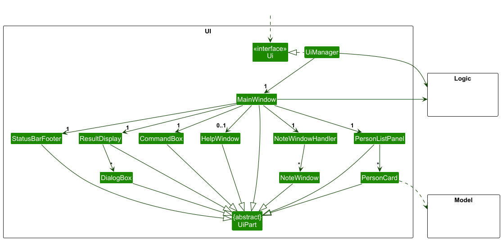
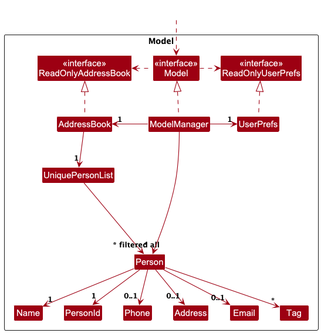

* Table of Contents
{:toc}

--------------------------------------------------------------------------------------------------------------------

## **Acknowledgements**

* Libraries used: [_JavaFX_](https://openjfx.io/), [_JUnit5_](https://github.com/junit-team/junit5)
* This project is based on the AddressBook-Level3 project created by the [SE-EDU initiative](https://se-education.org).
* We would also like to thank all professors, TAs, PE Dry Run Testers, coursemates and friends who have helped and supported us throughout the project.

--------------------------------------------------------------------------------------------------------------------

## **Setting up, getting started**

Refer to the guide [_Setting up and getting started_](SettingUp.md).

--------------------------------------------------------------------------------------------------------------------

## **Design**

:bulb: **Tip:** The `.puml` files used to create diagrams in this document `docs/diagrams` folder. Refer to the [_PlantUML Tutorial_ at se-edu/guides](https://se-education.org/guides/tutorials/plantUml.html) to learn how to create and edit diagrams.

### Architecture

The ***Architecture Diagram*** given above explains the high-level design of the App.

Given below is a quick overview of main components and how they interact with each other.

**Main components of the architecture**

**`Main`** (consisting of classes [`Main`](https://github.com/se-edu/addressbook-level3/tree/master/src/main/java/seedu/address/Main.java) and [`MainApp`](https://github.com/se-edu/addressbook-level3/tree/master/src/main/java/seedu/address/MainApp.java)) is in charge of the app launch and shut down.
* At app launch, it initializes the other components in the correct sequence, and connects them up with each other.
* At shut down, it shuts down the other components and invokes cleanup methods where necessary.

The bulk of the app's work is done by the following four components:

* [**`UI`**](#ui-component): The UI of the App.
* [**`Logic`**](#logic-component): The command executor.
* [**`Model`**](#model-component): Holds the data of the App in memory.
* [**`Storage`**](#storage-component): Reads data from, and writes data to, the hard disk.

[**`Commons`**](#common-classes) represents a collection of classes used by multiple other components.

**How the architecture components interact with each other**

The *Sequence Diagram* below shows how the components interact with each other for the scenario where the user issues the command `delete 1`.

Each of the four main components (also shown in the diagram above),

* defines its *API* in an `interface` with the same name as the Component.
* implements its functionality using a concrete `{Component Name}Manager` class (which follows the corresponding API `interface` mentioned in the previous point.

For example, the `Logic` component defines its API in the `Logic.java` interface and implements its functionality using the `LogicManager.java` class which follows the `Logic` interface. Other components interact with a given component through its interface rather than the concrete class (reason: to prevent outside component's being coupled to the implementation of a component), as illustrated in the (partial) class diagram below.

The sections below give more details of each component.

### UI component

The **API** of this component is specified in [`Ui.java`](https://github.com/se-edu/addressbook-level3/tree/master/src/main/java/seedu/address/ui/Ui.java)

The UI consists of a `MainWindow` that is made up of parts e.g.`CommandBox`, `ResultDisplay`, `PersonListPanel`, `StatusBarFooter` etc. All these, including the `MainWindow`, inherit from the abstract `UiPart` class which captures the commonalities between classes that represent parts of the visible GUI.

The `UI` component uses the JavaFx UI framework. The layout of these UI parts are defined in matching `.fxml` files that are in the `src/main/resources/view` folder. For example, the layout of the [`MainWindow`](https://github.com/se-edu/addressbook-level3/tree/master/src/main/java/seedu/address/ui/MainWindow.java) is specified in [`MainWindow.fxml`](https://github.com/se-edu/addressbook-level3/tree/master/src/main/resources/view/MainWindow.fxml)

The `UI` component,

* executes user commands using the `Logic` component.
* listens for changes to `Model` data so that the UI can be updated with the modified data.
* keeps a reference to the `Logic` component, because the `UI` relies on the `Logic` to execute commands.
* depends on some classes in the `Model` component, as it displays `Person` object residing in the `Model`.

### Logic component

**API** : [`Logic.java`](https://github.com/se-edu/addressbook-level3/tree/master/src/main/java/seedu/address/logic/Logic.java)

Here's a (partial) class diagram of the `Logic` component:

The sequence diagram below illustrates the interactions within the `Logic` component, taking `execute("delete 1")` API call as an example.

:information_source: **Note:** The lifeline for `DeleteCommandParser` should end at the destroy marker (X) but due to a limitation of PlantUML, the lifeline continues till the end of diagram.

How the `Logic` component works:

1. When `Logic` is called upon to execute a command, it is passed to an `AddressBookParser` object which in turn creates a parser that matches the command (e.g., `DeleteCommandParser`) and uses it to parse the command.
1. This results in a `Command` object (more precisely, an object of one of its subclasses e.g., `DeleteCommand`) which is executed by the `LogicManager`.
1. The command can communicate with the `Model` when it is executed (e.g. to delete a person). 
   Note that although this is shown as a single step in the diagram above (for simplicity), in the code it can take several interactions (between the command object and the `Model`) to achieve.
1. The result of the command execution is encapsulated as a `CommandResult` object which is returned back from `Logic`.

Here are the other classes in `Logic` (omitted from the class diagram above) that are used for parsing a user command:

How the parsing works:
* When called upon to parse a user command, the `AddressBookParser` class creates an `XYZCommandParser` (`XYZ` is a placeholder for the specific command name e.g., `AddCommandParser`) which uses the other classes shown above to parse the user command and create a `XYZCommand` object (e.g., `AddCommand`) which the `AddressBookParser` returns back as a `Command` object.
* All `XYZCommandParser` classes (e.g., `AddCommandParser`, `DeleteCommandParser`, ...) inherit from the `Parser` interface so that they can be treated similarly where possible e.g, during testing.

### Model component
**API** : [`Model.java`](https://github.com/se-edu/addressbook-level3/tree/master/src/main/java/seedu/address/model/Model.java)

The `Model` component,

* stores the address book data i.e., all `Person` objects (which are contained in a `UniquePersonList` object).
* stores the currently 'selected' `Person` objects (e.g., results of a search query) as a separate _filtered_ list which is exposed to outsiders as an unmodifiable `ObservableList<Person>` that can be 'observed' e.g. the UI can be bound to this list so that the UI automatically updates when the data in the list change.
* stores a `UserPref` object that represents the user’s preferences. This is exposed to the outside as a `ReadOnlyUserPref` objects.
* does not depend on any of the other three components (as the `Model` represents data entities of the domain, they should make sense on their own without depending on other components)

:information_source: **Note:** An alternative (arguably, a more OOP) model is given below. It has a `Tag` list in the `AddressBook`, which `Person` references. This allows `AddressBook` to only require one `Tag` object per unique tag, instead of each `Person` needing their own `Tag` objects. 

### Storage component

**API** : [`Storage.java`](https://github.com/se-edu/addressbook-level3/tree/master/src/main/java/seedu/address/storage/Storage.java)

The `Storage` component,
* can save both address book data and user preference data in JSON format, and read them back into corresponding objects.
* inherits from both `AddressBookStorage` and `UserPrefStorage`, which means it can be treated as either one (if only the functionality of only one is needed).
* depends on some classes in the `Model` component (because the `Storage` component's job is to save/retrieve objects that belong to the `Model`)

### Common classes

Classes used by multiple components are in the `seedu.address.commons` package.

--------------------------------------------------------------------------------------------------------------------

## **Implementation**

This section describes some noteworthy details on how certain features are implemented.

### \[Proposed\] Undo/redo feature

#### Proposed Implementation

The proposed undo/redo mechanism is facilitated by `VersionedAddressBook`. It extends `AddressBook` with an undo/redo history, stored internally as an `addressBookStateList` and `currentStatePointer`. Additionally, it implements the following operations:

* `VersionedAddressBook#commit()` — Saves the current address book state in its history.
* `VersionedAddressBook#undo()` — Restores the previous address book state from its history.
* `VersionedAddressBook#redo()` — Restores a previously undone address book state from its history.

These operations are exposed in the `Model` interface as `Model#commitAddressBook()`, `Model#undoAddressBook()` and `Model#redoAddressBook()` respectively.

Given below is an example usage scenario and how the undo/redo mechanism behaves at each step.

Step 1. The user launches the application for the first time. The `VersionedAddressBook` will be initialized with the initial address book state, and the `currentStatePointer` pointing to that single address book state.

Step 2. The user executes `delete 5` command to delete the 5th person in the address book. The `delete` command calls `Model#commitAddressBook()`, causing the modified state of the address book after the `delete 5` command executes to be saved in the `addressBookStateList`, and the `currentStatePointer` is shifted to the newly inserted address book state.

Step 3. The user executes `add n/David …​` to add a new person. The `add` command also calls `Model#commitAddressBook()`, causing another modified address book state to be saved into the `addressBookStateList`.

:information_source: **Note:** If a command fails its execution, it will not call `Model#commitAddressBook()`, so the address book state will not be saved into the `addressBookStateList`.

Step 4. The user now decides that adding the person was a mistake, and decides to undo that action by executing the `undo` command. The `undo` command will call `Model#undoAddressBook()`, which will shift the `currentStatePointer` once to the left, pointing it to the previous address book state, and restores the address book to that state.

:information_source: **Note:** If the `currentStatePointer` is at index 0, pointing to the initial AddressBook state, then there are no previous AddressBook states to restore. The `undo` command uses `Model#canUndoAddressBook()` to check if this is the case. If so, it will return an error to the user rather
than attempting to perform the undo.

The following sequence diagram shows how an undo operation goes through the `Logic` component:

:information_source: **Note:** The lifeline for `UndoCommand` should end at the destroy marker (X) but due to a limitation of PlantUML, the lifeline reaches the end of diagram.

Similarly, how an undo operation goes through the `Model` component is shown below:

The `redo` command does the opposite — it calls `Model#redoAddressBook()`, which shifts the `currentStatePointer` once to the right, pointing to the previously undone state, and restores the address book to that state.

:information_source: **Note:** If the `currentStatePointer` is at index `addressBookStateList.size() - 1`, pointing to the latest address book state, then there are no undone AddressBook states to restore. The `redo` command uses `Model#canRedoAddressBook()` to check if this is the case. If so, it will return an error to the user rather than attempting to perform the redo.

Step 5. The user then decides to execute the command `list`. Commands that do not modify the address book, such as `list`, will usually not call `Model#commitAddressBook()`, `Model#undoAddressBook()` or `Model#redoAddressBook()`. Thus, the `addressBookStateList` remains unchanged.

Step 6. The user executes `clear`, which calls `Model#commitAddressBook()`. Since the `currentStatePointer` is not pointing at the end of the `addressBookStateList`, all address book states after the `currentStatePointer` will be purged. Reason: It no longer makes sense to redo the `add n/David …​` command. This is the behavior that most modern desktop applications follow.

The following activity diagram summarizes what happens when a user executes a new command:

#### Design considerations:

**Aspect: How undo & redo executes:**

* **Alternative 1 (current choice):** Saves the entire address book.
  * Pros: Easy to implement.
  * Cons: May have performance issues in terms of memory usage.

* **Alternative 2:** Individual command knows how to undo/redo by
  itself.
  * Pros: Will use less memory (e.g. for `delete`, just save the person being deleted).
  * Cons: We must ensure that the implementation of each individual command are correct.

_{more aspects and alternatives to be added}_

--------------------------------------------------------------------------------------------------------------------

## **Documentation, logging, testing, configuration, dev-ops**

* [Documentation guide](Documentation.md)
* [Testing guide](Testing.md)
* [Logging guide](Logging.md)
* [Configuration guide](Configuration.md)
* [DevOps guide](DevOps.md)

--------------------------------------------------------------------------------------------------------------------

## **Appendix: Requirements**

### Product scope

**Target user profile**:  
* has a need to manage a significant number of contacts  
* prefers desktop apps over other types  
* can type fast  
* prefers typing to mouse interactions  
* is reasonably comfortable using CLI apps  
* requires a way to categorise and group contacts easily  
* requires a high level of privacy

**Value proposition**: manage contacts faster than a typical mouse/GUI-driven app, keep contacts safe  

### User Stories

Priorities: High (must have) - `* * *`, Medium (nice to have) - `* *`, Low (unlikely to have) - `*`

| Priority | As a … | I want to … | So that I can… |
|----------|--------|------------|----------------|
| `* * *` | new user | see usage instructions | refer to instructions when I forget how to use the App |
| `* * *` | user | add a new contact | |
| `* * *` | user | delete a contact | remove them if they are no longer relevant to my investigations |
| `* * *` | user | find a person by name | locate details of persons without having to go through the entire list |
| `* * *` | user | tag contacts by credibility (e.g. verified, unverified, anonymous) | assess reliability quickly |
| `* * *` | user | search for a contact by tags (e.g. topic, organization) | quickly find relevant contacts |
| `* * *` | user | access previously saved contacts | contact people that I have saved the contacts of |
| `* * *` | user | keep my contacts locally on my device | maintain the privacy of my contacts |
| `* * *` | user | save the home address of a contact | know where to find them if required |
| `* *` | user | edit previously saved contacts | change contacts if they have any different information |
| `* *` | user | hide private contact details | minimize chance of someone else seeing them by accident |
| `* *` | user | export my saved contacts to a different device and have them read easily by the same program | transfer my files to different devices easily |
| `*` | user | log conversation notes with each contact | keep track of all my notes and critical information in one place |
| `*` | user | view a conversation note | refer back to previously recorded conversation note |
| `*` | user | delete conversation notes for each contact | delete conversation notes that are no longer relevant to prevent clutter |
| `*` | user | export my notes to a .txt / .pdf file | share information with my team |
| `*` | user | create keyboard shortcuts for frequently used actions | work faster |
| `*` | user | view my existing keyboard shortcuts | remind myself what keyboard shortcuts I currently have |
| `*` | user | delete an existing keyboard shortcut | update my keyboard shortcuts if I have a change of preference |
| `*` | user | copy important pieces of information quickly | call or email my contacts |
| `*` | user | see when a contact was saved | keep track of when I met the contact |
| `*` | user | set follow-up reminders | do not miss out on getting updates from my contacts |
| `*` | user | create investigations (groups) | group related contacts together |
| `*` | user | add a profile photo for contacts | remember their faces too |

### Use Cases

**Use case: Ask for help - UC1**

**MSS**

1. User asks for help regarding instructions.
2. ScoopBook directs User to a website with detailed instructions for each functionality.

   Use case ends.

**Use case: Add a contact - UC2**

**MSS**

1. User requests to add a contact with information into the list.
2. ScoopBook adds contact into the list.

   Use case ends.

**Extensions**

* 2a. The input given by User is invalid.
    * 2a1. ScoopBook shows an error message.

      Use case resumes at step 1.

**Use case: View contacts - UC3**

**MSS**

1. User requests to view list of contacts.
2. ScoopBook shows a list of contacts.

   Use case ends.

**Extensions**

* 2a. Contact list is empty.

  Use case ends.

**Use case: Delete a contact - UC4**

**MSS**

1. User requests to view contacts (UC3).
2. User requests to delete a specific contact in the list.
3. ScoopBook deletes the contact.

   Use case ends.

**Extensions**

* 2a. The given index is invalid, or the input is not a number.
    * 2a1. ScoopBook shows an error message.

      Use case resumes at step 1.

**Use case: Edit a contact - UC5**

**MSS**

1. User requests to view contacts (UC3).
2. User requests to edit a specific contact in the list.
3. ScoopBook edits that contact.

   Use case ends.

**Extensions**

* 2a. The given input is invalid.
    * 2a1. ScoopBook shows an error message.

      Use case resumes at step 1.

**Use case: Add tag(s) to a contact - UC6**

**MSS**

1. User requests to view contacts (UC3).
2. User requests to add tags to a specific contact in the list.
3. ScoopBook adds tags to that contact.

   Use case ends.

**Extensions**

* 2a. User provides an invalid input.
    * 2a1. ScoopBook shows an error message.

      Use case resumes at step 1.

**Use case: Remove tag(s) to a contact - UC7**

**MSS**

1. User requests to view contacts (UC3).
2. User requests to remove tag(s) from a specific contact in the list.
3. ScoopBook removes the specified tags from the specified contact.

   Use case ends.

**Extensions**

* 2a. The given index is invalid, or the input tag does not exist.
    * 2a1. ScoopBook shows an error message.

      Use case resumes at step 1.

**Use case: Search contact by name - UC8**

**MSS**

1. User requests to search for contacts based on keywords.
2. ScoopBook displays a list of contacts whose name matches the keywords.

   Use case ends.

**Extensions**

* 2a. No contact matches with the keywords.
    * 2a1. ScoopBook shows an error message.

      Use case resumes at step 1.

**Use case: Search contact by tag - UC9**

**MSS**

1. User requests to search for contacts based on tags.
2. ScoopBook displays a list of contacts that match the tags.

   Use case ends.

**Extensions**

* 2a. No contact matches with the tags.
    * 2a1. ScoopBook shows an error message.

      Use case resumes at step 1.

**Use case: Export contacts - UC10**

**MSS**

1. User requests to export contacts to a specified file location.
2. ScoopBook saves the relevant contacts in the export file.

   Use case ends.

**Extensions**
  
* 1a. User provided file location is invalid
   * 1a1. Scoopbook raises an error

     Use case ends.

**Use case: Import contacts - UC11**

**MSS**

1. User requests to import contacts.
2. ScoopBook prompts the location of the import file.
3. User confirms the file location.
4. ScoopBook imports the relevant contacts from the import file.

   Use case ends.

**Extensions**

* 2a. User decides to cancel the operation.

  Use case ends.
  
* 3a. User provided file location is invalid
   * 3a1. Scoopbook raises an error
  
     Use case ends.
     
* 4a. User provided file is invalid format
   * 4a1. Scoopbook raises an error
  
     Use case ends.

**Use case: Create investigation - UC12 (To be implemented)**

**MSS**

1. User requests to create an investigation.
2. ScoopBook creates the investigation.

   Use case ends.

**Extensions**

* 1a. The name of the investigation already exists.
    * 1a1. ScoopBook informs User that there is already an investigation with the same name.

      Use case ends.

**Use case: Add contact to investigation - UC13 (To be implemented)**

**MSS**

1. User requests to add a contact to an existing investigation.
2. ScoopBook adds the contact to the specified investigation.

   Use case ends.

**Extensions**

* 1a. The investigation specified by User does not exist.
    * 1a1. ScoopBook informs User that no such investigation exists.

      Use case ends.

* 1b. The contact specified by User does not exist.
    * 1b1. ScoopBook informs User that no such contact exists.

      Use case ends.

* 1c. Multiple contacts contain the keywords specified by User.
    * 1c1. ScoopBook informs User that there are duplicates, and that the operation cannot be performed.

      Use case ends.

**Use case: Remove contact from investigation - UC14 (To be implemented)**

**MSS**

1. User requests to remove a contact from an existing investigation.
2. ScoopBook removes the contact from the specified investigation.

   Use case ends.

**Extensions**

* 1a. The investigation specified by User does not exist.
    * 1a1. ScoopBook informs User that no such investigation exists.

      Use case ends.

* 1b. The contact specified by User does not exist in the investigation.
    * 1b1. ScoopBook informs User that no such contact exists.

      Use case ends.

* 1c. Multiple contacts or investigations contain the keywords specified by User.
    * 1c1. ScoopBook informs User that there are duplicates, and that the operation cannot be performed.

      Use case ends.

**Use case: View and edit specific conversation note - UC15**

**MSS**

1. User requests to view contacts (UC3).
2. User requests to view a specific conversation note from a specific contact.
3. ScoopBook displays the specified conversation note to edit.

   Use case ends.

**Extensions**

* 2a. The given conversation note index or contact index is invalid.
    * 2a1. ScoopBook shows an error message.

      Use case resumes at step 1.

**Use case: Delete conversation note - UC16**

**MSS**

1. User requests to view contacts (UC3).
2. User requests to delete a specific conversation note by index.
3. ScoopBook deletes the conversation note.

   Use case ends.

**Extensions**

* 2a. User provides an invalid input.
    * 2a1. ScoopBook shows an error message.

      Use case resumes at step 1.

**Use case: Export note - UC17 (To be implemented)**

**MSS**

1. User requests to view contact (UC3).
2. User requests to export notes by index or export all for a specific contact.
3. ScoopBook prompts the location to save the export file of notes in.
4. User confirms the save location.
5. ScoopBook saves the relevant notes in the export file.

   Use case ends.

**Extensions**

* 2a. The given contact index or notes indexes are invalid.
    * 2a1. ScoopBook shows an error message.

      Use case resumes at step 1.

* 3a. User decides to cancel the operation.

  Use case resumes at step 1.

**Use case: View keyboard shortcuts - UC18 (To be implemented)**

**MSS**

1. User requests to view keyboard shortcuts.
2. ScoopBook displays all actions with keyboard shortcuts with their respective shortcuts.

   Use case ends.

**Extensions**

* 2a. Keyboard shortcut list is empty.
    * 2a1. ScoopBook displays an empty list.

      Use case ends.

**Use case: Create keyboard shortcuts - UC19 (To be implemented)**

**MSS**

1. User requests to view keyboard shortcuts (UC18).
2. User requests to create keyboard shortcuts.
3. ScoopBook displays available actions that can be assigned to a shortcut.
4. User selects a specific action and specifies a key combination.
5. ScoopBook assigns the shortcut.

   Use case ends.

**Extensions**

* 4a. User provides an invalid action index.
    * 4a1. ScoopBook shows an error message.

      Use case resumes at step 3.

* 4b. User provides an invalid or existing shortcut combination.
    * 4b1. ScoopBook shows an error message.

      Use case resumes at step 3.

**Use case: Delete keyboard shortcuts - UC20 (To be implemented)**

**MSS**

1. User requests to view keyboard shortcuts (UC18).
2. User requests to delete a specific keyboard shortcut in the list.
3. ScoopBook deletes the specific keyboard shortcut.

   Use case ends.

**Extensions**

* 2a. User provides an invalid index.
    * 2a1. ScoopBook shows an error message.

      Use case resumes at step 1.

**Use case: Set follow-up reminder - UC21 (To be implemented)**

**MSS**

1. User requests to view contacts (UC3).
2. User requests to set a follow-up reminder to specific contact.
3. ScoopBook sets a follow-up reminder.

   Use case ends.

**Extensions**

* 2a. User provides an invalid input.
    * 2a1. ScoopBook shows an error message.

      Use case resumes at step 1.

**Use case: Delete follow-up reminder - UC22 (To be implemented)**

**MSS**

1. User requests to view contacts (UC3).
2. User requests to delete a specific follow-up reminder to a specific contact.
3. ScoopBook deletes the follow-up reminder.

   Use case ends.

**Extensions**

* 2a. User provides an invalid input.
    * 2a1. ScoopBook shows an error message.

      Use case resumes at step 1.

**Use case: Add profile photo - UC23 (To be implemented)**

**MSS**

1. User requests to view contacts (UC3).
2. User requests to add a profile photo for a specific contact.
3. ScoopBook prompts the location to access the profile photo file.
4. User selects the profile photo.
5. ScoopBook saves the profile photo.

   Use case ends.

**Extensions**

* 2a. User provides an invalid input.
    * 2a1. ScoopBook shows an error message.

      Use case resumes at step 1.

* 4a. User selects an invalid file.
    * 4a1. ScoopBook shows an error message.

      Use case resumes at step 2.

      
### Non-Functional Requirements

* Should work on any mainstream OS as long as it has Java 17 installed.
* Should be able to store up to 1000 persons with no more than 1s of response per command entered.
* A user with above-average typing speed (50 WPM) for regular English text (i.e., not code, not system admin commands) should be able to accomplish most basic tasks like adding contacts faster using commands than using the mouse.
* Should not require a login, since ScoopBook is on a user’s own device.
* All user data must be stored locally and should not require an internet connection for core functionality.
* The application must be developed using modular, well-documented code to support future feature additions and maintenance.

### Glossary

**OS**: Operating System. A program that manages both hardware and software on a device.

**CLI**: Command Line Interface. A mechanism through which users interact with their operating system.

**CLI (-based) app**: An app primarily based on the key feature of the CLI, which is text-based typing.

**GUI**: Graphical User Interface. A form of user interface that allows users to interact with electronic devices through graphical icons and visual indicators.

**User**: The person using ScoopBook.

**Attributes**: Relevant information that a contact may have. E.g., “high priority,” “whistleblower,” or “government official.”

**Investigation**: A group of contacts that share some commonality. Users can create investigations and choose who to add to or remove from them.

--------------------------------------------------------------------------------------------------------------------

## **Appendix: Instructions for manual testing**

Given below are instructions to test the app manually.

:information_source: **Note:** These instructions only provide a starting point for testers to work on;
testers are expected to do more *exploratory* testing.

### Launch and shutdown

1. Initial launch

   1. Download the jar file and copy into an empty folder

   2. Using your computer's terminal, `cd` into the folder in the previous step.

   3. use `java -jar scoopbook.jar` to open the application

1. Saving window preferences

   1. Resize the window to an optimum size. Move the window to a different location. Close the window.

   1. Re-launch the app by double-clicking the jar file. 
       Expected: The most recent window size and location is retained.

---

### Viewing Help

**Test case:** `help`  
**Expected:** Opens the help window with instructions on how to use the commands.

**Test case:** `help 123`  
**Expected:** Still opens the help window; extraneous parameter is ignored.

---

### Adding a person

**Prerequisite:** App is launched.

**Test case:** `add n/John Doe p/98765432 e/johnd@example.com a/123 John Street`  
**Expected:** Adds John Doe to the contact list. Details shown in result display.

**Test case:** `add n/Betsy Crowe t/friend e/betsycrowe@example.com a/Newgate Prison p/1234567 t/criminal t/silent`  
**Expected:** Adds Betsy Crowe with multiple tags.

**Test case:** `add n/Johnny Appleseed`  
**Expected:** Error shown. Missing phone, email, or address.

**Test case:** `add n/John! Doe p/1234567`  
**Expected:** Error shown. Name contains non-alphanumeric characters.

---

### Listing all persons

**Test case:** `list`  
**Expected:** All persons currently in the address book are displayed.

**Test case:** `list 123`  
**Expected:** All persons currently in the address book are displayed. Extraneous parameters ignored.

---

### Editing a person

**Prerequisite:** At least 2 persons in the list.

**Test case:** `edit 1 p/91234567 e/johndoe@example.com`  
**Expected:** 1st person’s phone and email are updated.

**Test case:** `edit 2 n/Betsy Crower t/`  
**Expected:** Updates name, clears all tags.

**Test case:** `edit 2`  
**Expected:** Error. No field provided.

**Test case:** `edit 0 p/12345678`  
**Expected:** Error. Index must be a positive integer.

---

### Finding persons by name

**Test case:** `find John`  
**Expected:** Displays persons with names containing “John”.

**Test case:** `find alex david`  
**Expected:** Displays any persons with name containing “alex” or “david”.

**Test case:** `find Han`  
**Expected:** No match for "Hans". Partial matches not allowed.

---

### Deleting a person

**Prerequisites:** Should have at least 1 contact in the menu.
**Test case:** `delete 1` (after `list`)  
**Expected:** Deletes first contact. Status bar updated.

**Test case:** `delete 0`  
**Expected:** Error. Invalid index.

**Test case:** `delete`  
**Expected:** Error. Missing index.

---

### Adding tags

**Prerequisite:** Should have at least 1 contact in the menu.

**Test case:** `addtag 1 t/friend t/neighbour`  
**Expected:** Adds both tags to person at index 1.

**Test case:** `addtag 2 t/friend!`  
**Expected:** Error. Tag contains invalid character.

---

### Removing tags

**Prerequisite:** Should have at least 1 contact in the menu. The first contact should have `friend` as a tag.

**Test case:** `removetag 1 t/friend`  
**Expected:** Removes "friend" tag.

**Test case:** `removetag 1 t/Friend`  
**Expected:** No tag removed. Case mismatch.

---

### Finding by tag

**Test case:** `findtag t/friends`  
**Expected:** Displays persons with tag "friends", "Friends", etc.

**Test case:** `findtag t/friends t/neighbours`  
**Expected:** Only persons with both tags are displayed.

---

### Notes

**Prerequisite:** Should have at least 1 contact in the menu.

**Test case:** `note 1`  
**Expected:** Opens a note window for person at index 1.

**Test case:** `note 0`  
**Expected:** Error. Invalid index.

---

### Deleting a note

**Prerequisites:** Should have at least 1 contact in the menu.
**Test case:** `deletenote 1`  
**Expected:** Deletes note from person at index 1.

**Test case:** `deletenote`  
**Expected:** Error. Missing index.

---

### Clearing all entries

**Test case:** `clear`  
**Expected:** Deletes all persons from the address book.

**Test case:** `clear abc`  
**Expected:** Still clears all entries. Extraneous parameter ignored.

---

### Export

**Test case:** `export Contacts.json`  
**Expected:** Exports current contacts as `Contacts.json` in working directory.

**Test case:** `export /invalid/path/Contacts.json`  
**Expected:** Error shown. Invalid path.

---

### Import

**Test case:** `import Contacts.json` (valid exported file)  
**Expected:** Replaces all contacts with imported data. Notes are deleted.

**Test case:** `import corrupted.json`  
**Expected:** All data discarded. App starts with empty address book.

---

### Saving

**Prerequisite:** Should have at least 1 contact in the menu.

**Test case:** `note 1`. Then, add random text. Then, close the note window. Enter `note 1` again.
**Expected:** Application closes.

**Test case:** `list`. Then, `addtag 1 t/colleague`. Use `exit` to exit the application. Launch the application again.
**Expected:**  Upon opening the application, the first contact should have the tag `colleague`.

---

### Exit

**Test case:** `exit`  
**Expected:** Application closes.

--------------------------------------------------------------------------------------------------------------------

## **Appendix: Planned Enhancements**

Team size: 5

1. **Removing placeholder values for Person:** Currently Person uses a placeholder value for optional fields in the contact. I.e., if Alex Yeoh has a phone number only, the email and address fields will be replaced with a placeholder value instead of being blank. We plan to wrap each field in an Optional class so that it is able to handle empty values rather than leaving it with a placeholder value.
2. **Person cards to be more visible for longer texts:** Currently, Person fields truncates long text fields (i.e., Name, Phone Number, Email, Address). For example, if the name exceeds a certain length, it will be truncated with a "...". It shall be updated in future iterations to be able to display the whole text field by using a scrolling mechanic to see the whole text field for all fields (Name, Phone Number, Email, Address, Tags).
3. **Standardise error messages for commands that use Index referencing:** Currently, commands that use index referencing do not return the same error message for different cases of index errors. Invalid cases include: out of bounds for addressbook, non-positive integers, non-integers. We plan to standardise the index error messages to the different cases of invalid index accordingly.
4. **Improve search commands**: `find` command currently uses an OR operator to search. (i.e. `find John Mary` will return contacts with names `John`, `Mary`, and `John Mary`, but `John Mary` does not appear as the first contact). `find` shall be updated to return results where the first contact is the most relevant contact (i.e Names with `John Mary`) followed by other contacts.

