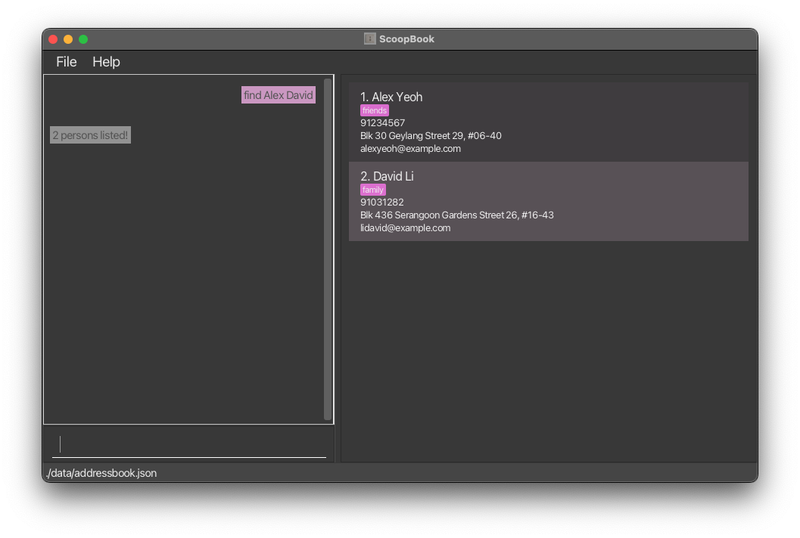

ScoopBook is a **desktop app for managing contacts, optimized for use via a Command Line Interface** (CLI) while still having the benefits of a Graphical User Interface (GUI). If you can type fast, ScoopBook can get your contact management tasks done faster than traditional GUI apps. Made with journalists in mind, this app boasts **efficient categorisation** and **searching** of contacts.

* Table of Contents
{:toc}

--------------------------------------------------------------------------------------------------------------------

## Quick start

1. Ensure you have Java `17` or above installed in your Computer. 
   **Mac users:** Ensure you have the precise JDK version prescribed [here](https://se-education.org/guides/tutorials/javaInstallationMac.html).

2. Download the latest `.jar` file from [here](https://github.com/AY2425S2-CS2103T-W13-1/tp/releases).

3. Copy the file to the folder you want to use as the _home folder_ for your ScoopBook.

4. Open a command terminal, `cd` into the folder you put the jar file in, and use the `java -jar scoopbook.jar` command to run the application. 
   A GUI similar to the below should appear in a few seconds. Note how the app contains some sample data. 
   

5. Type the command in the command box and press Enter to execute it. e.g. typing **`help`** and pressing Enter will open the help window. 
   Some example commands you can try:

   * `list` : Lists all contacts.

   * `add n/John Doe p/98765432 e/johnd@example.com a/John street, block 123, #01-01` : Adds a contact named `John Doe` to the address book.

   * `delete 3` : Deletes the 3rd contact shown in the current list.

   * `clear` : Deletes all contacts.

   * `exit` : Exits the app.

6. Refer to the [Features](#features) below for details of each command.

--------------------------------------------------------------------------------------------------------------------

## Features

**:information_source: Notes about the command format:** 

* Words in `UPPER_CASE` are the parameters to be supplied by the user. 
  e.g. in `add n/NAME`, `NAME` is a parameter which can be used as `add n/John Doe`.

* Items in square brackets are optional. 
  e.g `n/NAME [t/TAG]` can be used as `n/John Doe t/friend` or as `n/John Doe`.

* Items with `…`​ after them can be used multiple times including zero times. 
  e.g. `[t/TAG]…​` can be used as ` ` (i.e. 0 times), `t/friend`, `t/friend t/family` etc.

* Parameters can be in any order. 
  e.g. if the command specifies `n/NAME p/PHONE_NUMBER`, `p/PHONE_NUMBER n/NAME` is also acceptable.

* Extraneous parameters for commands that do not take in parameters (such as `help`, `list`, `exit` and `clear`) will be ignored. 
  e.g. if the command specifies `help 123`, it will be interpreted as `help`.

* If you are using a PDF version of this document, be careful when copying and pasting commands that span multiple lines as space characters surrounding line-breaks may be omitted when copied over to the application.

### Viewing help : `help`

Shows the user guide, containing instructions on how to use the command.

Format: `help`

### Adding a person: `add`

Adds a person to the address book.

Format: `add n/NAME [p/PHONE_NUMBER] [e/EMAIL] [a/ADDRESS] [t/TAG]…​`

* The add command **must** have a name, and one of the following fields: phone number, email, address.
  i.e. `add n/Johnny Appleseed` does not work because there is no phone number, email or address.
* A person can have any number of tags (including 0).

Examples:
* `add n/John Doe p/98765432 e/johnd@example.com a/John street, block 123, #01-01`
* `add n/Betsy Crowe t/friend e/betsycrowe@example.com a/Newgate Prison p/1234567 t/criminal`

### Listing all persons : `list`

Shows a list of all persons in the address book.

Format: `list`

* Only this format of the command is allowed, any other format will not work. e.g. `list 123` will not work.

### Editing a person : `edit`

Edits an existing person in the address book.

Format: `edit INDEX [n/NAME] [p/PHONE] [e/EMAIL] [a/ADDRESS] [t/TAG]…​`

* Edits the person at the specified `INDEX`. The index refers to the index number shown in the displayed person list. The index **must be a positive integer** 1, 2, 3, …​
* At least one of the optional fields must be provided.
* Existing values will be updated to the input values.
* When editing tags, the existing tags of the person will be removed i.e adding of tags is not cumulative.
* You can remove all the person’s tags by typing `t/` without
    specifying any tags after it.

Examples:
*  `edit 1 p/91234567 e/johndoe@example.com` Edits the phone number and email address of the 1st person to be `91234567` and `johndoe@example.com` respectively.
*  `edit 2 n/Betsy Crower t/` Edits the name of the 2nd person to be `Betsy Crower` and clears all existing tags.

### Locating persons by name: `find`

Finds persons whose names contain any of the given keywords.

Format: `find KEYWORD [MORE_KEYWORDS]`

* The search is case-insensitive. e.g `hans` will match `Hans`
* The order of the keywords does not matter. e.g. `Hans Bo` will match `Bo Hans`
* Only the name is searched.
* Only full words will be matched e.g. `Han` will not match `Hans`
* Persons matching at least one keyword will be returned (i.e. `OR` search).
  e.g. `Hans Bo` will return `Hans Gruber`, `Bo Yang`

Examples:
* `find John` returns `john` and `John Doe`
* `find alex david` returns `Alex Yeoh`, `David Li` 
  

### Deleting a person : `delete`

Deletes the specified person from the address book.

Format: `delete INDEX`

* Deletes the person at the specified `INDEX`.
* The index refers to the index number shown in the displayed person list.
* The index **must be a positive integer** 1, 2, 3, …​

Examples:
* `list` followed by `delete 2` deletes the 2nd person in the address book.
* `find Betsy` followed by `delete 1` deletes the 1st person in the results of the `find` command.

### Adding tags to a contact: `addtag`

Adds the tags typed in to the specified person.

Format: `addtag INDEX t/TAG1 [t/MORETAGS]`

* Adds the specified tags to the person at the specified `INDEX`.
* The index refers to the index number shown in the displayed person list.
* The index **must be a positive integer** 1, 2, 3, …​
* Multiple tags in a single `addtag` command is supported.
  i.e. `addtag 1 t/friend t/neighbour` will tag the 1st person with both "friend" and "neighbour".
* Tags can only contain alphanumeric characters (numbers or letters only, no special characters or spaces).

Examples:
* `list` followed by `addtag 2 t/friend` tags the 2nd person with "friends" in the address book.
* `find Betsy` followed by `addtag 1 t/friend` tags the 1st person in the results of the `find` command with "friends".

### Removing tag from a contact: `removetag`

Removes the specified tag from the person.

Format: `removetag INDEX t/TAG1 [t/MORETAGS]`

* Removes the specified tags from the person at the specified `INDEX`.
* The index refers to the index number shown in the displayed person list.
* The index **must be a positive integer** 1, 2, 3, …​
* Multiple tags in a single removetag command is supported.
  i.e. `removetag 1 t/friend t/neighbour` will remove both the "friend" and "neighbour" tag for the 1st person.
* Tags are case sensitive. The typed tag must match the tag on the person exactly.
  i.e. `removetag 1 t/friend` will not remove the tag "Friend".

Examples:
* `list` followed by `removetag 2 t/friend` removes the "friend" tag from the 2nd person in the address book.
* `find Betsy` followed by `removetag 1 t/friend` removes the "friend" tag from the 1st person in the results of the `find` command.

### Finding people with tags: `findtag`

Find persons who have all of the specified tags.

Format: `findtag t/TAG1 [t/MORETAGS]`

* The searching of tags is case-insensitive. e.g `friends` will match `Friends`
* The order of the tags does not matter. i.e. As long as the person has the listed tags, they will be shown.
* Only the tags are searched.
* Only full words will be matched e.g. `Friend` will not match `Friends`
* Only persons matching all the tags will be returned (i.e. `AND` search).

Examples:
* `findtag t/friends` returns people with tag `friends`, `Friends`, `FriEndS` (due to case insensitivity).
* `findtag t/friends t/neighbours` returns people with tag `friends` **and** `neighbours` only.

### Opening Note for Person: `note`

Open a window for the user to add notes to.
If the person at the specified `INDEX` already has a note, the note will be displayed and the user can edit it in the window.
Else, a new note will first be added for the person before the existing note is displayed.

Format: note INDEX

* Opens a window for the user to add notes to the person at the specified `INDEX`.
* The index refers to the index number shown in the displayed person list.
* The index must be a positive integer 1, 2, 3, …
* The note will be saved when the window is closed.

### Deleting Note from Person: `deletenote`

Deletes the note from the person.

Format: `deletenote INDEX`

* Deletes note for the person at the specified `INDEX`.
* The index refers to the index number shown in the displayed person list.
* The index **must be a positive integer** 1, 2, 3, …​

### Clearing all entries : `clear`

Clears all entries from the address book.

Format: `clear`

### Exiting the program : `exit`

Exits the program.

Format: `exit`

### Saving the data

ScoopBook data are saved in the hard disk automatically after any command that changes the data. There is no need to save manually.

### Editing the data file

ScoopBook data are saved automatically as a JSON file `[JAR file location]/data/addressbook.json`. Advanced users are welcome to update data directly by editing that data file.

:exclamation: **Caution:**
If your changes to the data file makes its format invalid, ScoopBook will discard all data and start with an empty data file at the next run. Hence, it is recommended to take a backup of the file before editing it. 
Furthermore, certain edits can cause the ScoopBook to behave in unexpected ways (e.g., if a value entered is outside of the acceptable range). Therefore, edit the data file only if you are confident that you can update it correctly.

### Archiving data files `[coming in v1.4]`

_Details coming soon ..._

--------------------------------------------------------------------------------------------------------------------

## FAQ

**Q**: How do I transfer my data to another Computer? 
**A**: Install the app in the other computer and overwrite the empty data file it creates with the file that contains the data of your previous ScoopBook home folder.

--------------------------------------------------------------------------------------------------------------------

## Known issues

1. **When using multiple screens**, if you move the application to a secondary screen, and later switch to using only the primary screen, the GUI will open off-screen. The remedy is to delete the `preferences.json` file created by the application before running the application again.
2. **If you minimize the Help Window** and then run the `help` command (or use the `Help` menu, or the keyboard shortcut `F1`) again, the original Help Window will remain minimized, and no new Help Window will appear. The remedy is to manually restore the minimized Help Window.

--------------------------------------------------------------------------------------------------------------------

## Command summary

Action | Format, Examples
--------|------------------
**Add** | `add n/NAME p/PHONE_NUMBER e/EMAIL a/ADDRESS [t/TAG]…​`   e.g., `add n/James Ho p/22224444 e/jamesho@example.com a/123, Clementi Rd, 1234665 t/friend t/colleague`
**Clear** | `clear`
**Delete** | `delete INDEX`  e.g., `delete 3`
**Edit** | `edit INDEX [n/NAME] [p/PHONE_NUMBER] [e/EMAIL] [a/ADDRESS] [t/TAG]…​`  e.g.,`edit 2 n/James Lee e/jameslee@example.com`
**Find** | `find KEYWORD [MORE_KEYWORDS]`  e.g., `find James Jake`
**Add Tag** | `addtag INDEX t/TAG1 [t/MORETAGS]…​`   e.g., `addtag 2 t/friend`
**Find Tag** | `findtag t/TAG1 [t/MORETAGS]…​`   e.g., `findtag t/friend`
**Remove Tag** | `removetag INDEX t/TAG1 [t/MORETAGS]…​`   e.g., `removetag 2 t/friend`
**Delete Note** | `deletenote INDEX`   e.g., `deletenote 3`
**List** | `list`
**Help** | `help`
